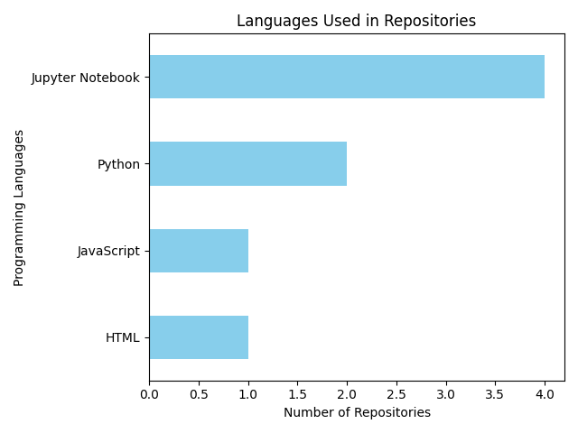

# GitHub Stats Visualizer

Analyzes and visualizes my GitHub repository activity using the GitHub API.

## What it does
- Fetches all public repos via GitHub API
- Cleans and structures data with pandas
- Visualizes language distribution

## How to run
pip install -r requirements.txt
python parse.py
python clean_repo.py
python visualize.py

## Charts

